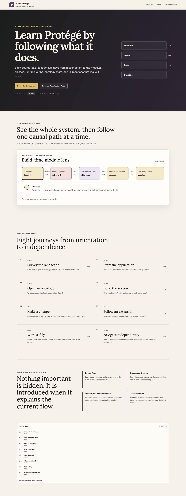
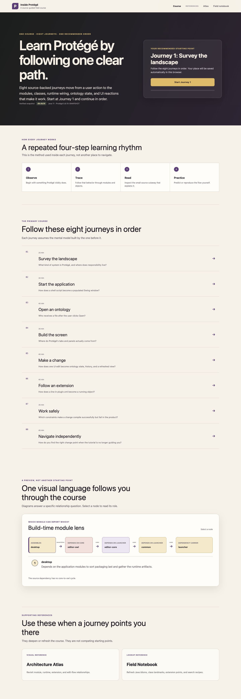
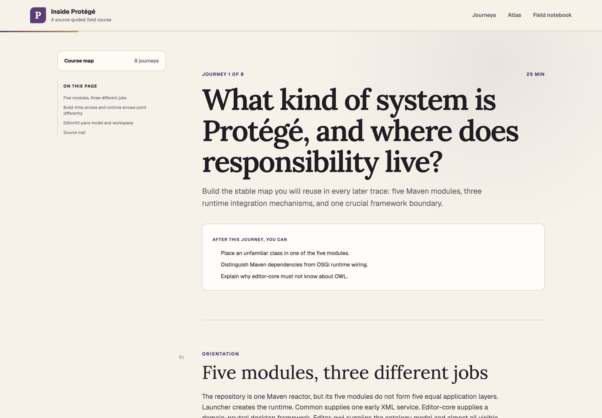
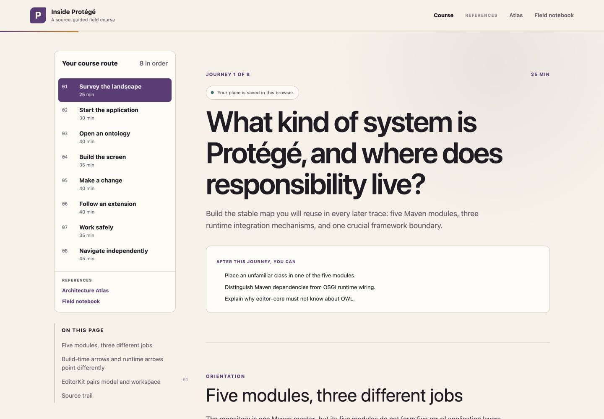

# Tutorial hierarchy and readability comparison

Method: in-app browser, 1440 by 1000 viewport, desktop layout. The Before
screenshots render public version 2 at commit `47ca45b`. The After screenshots
render the revised local production source under the same conditions.

| Area | Before | After |
| --- | --- | --- |
| Course direction | Two competing hero actions, an unexplained four-word panel, diagram before curriculum, and a duplicate course map | One Start or Resume action, explained learning rhythm, ordered curriculum first, and references explicitly secondary |
| Stop and resume | No persistent reading position | Lesson and scroll position save automatically in the current browser |
| Lesson rail | Collapsed 11px course titles and 10px section links | Expanded ordered route with 14px course titles and 14px section links |
| Selected diagram node | Heavy black outline that looked like a rendering defect | Purple border with a quiet inset selection marker |

## Home page

## Lesson navigation

Reproduce: render `/` and `/journeys/landscape` at a 1440 by 1000 viewport.

## Terminology, search, and branding

The six `before-terminology-*`, `after-terminology-*`, and
`*-technology-primer.png` captures compare commit `cd4f834` with the revised
production build at matching 1280 by 800 and 390 by 844 viewports. They cover
the header lockup, lesson language, search entry point, responsive fit, and the
first OSGi primer.

See `../terminology-search-branding-2026-08-12.md` for the measured comparison
and reproduction steps.
