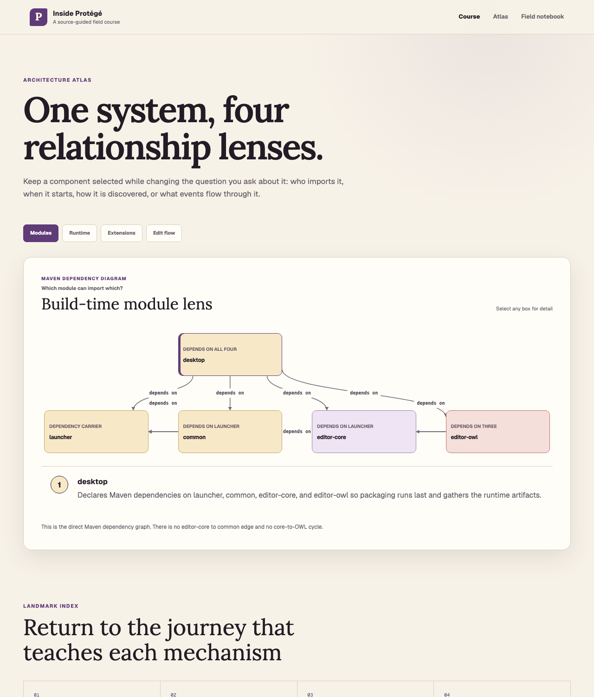
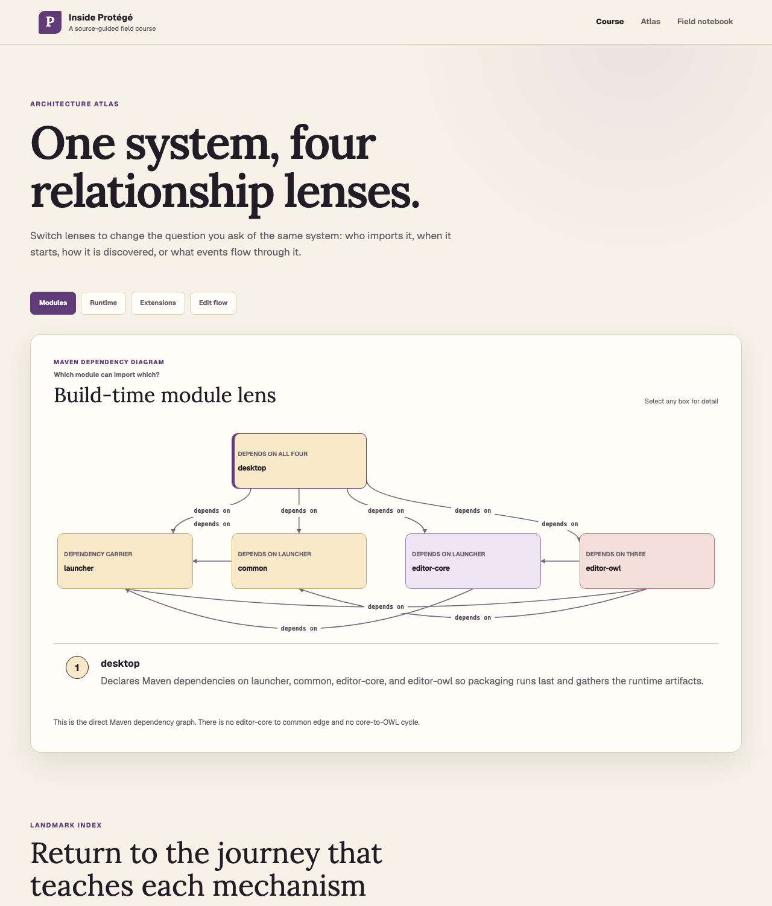
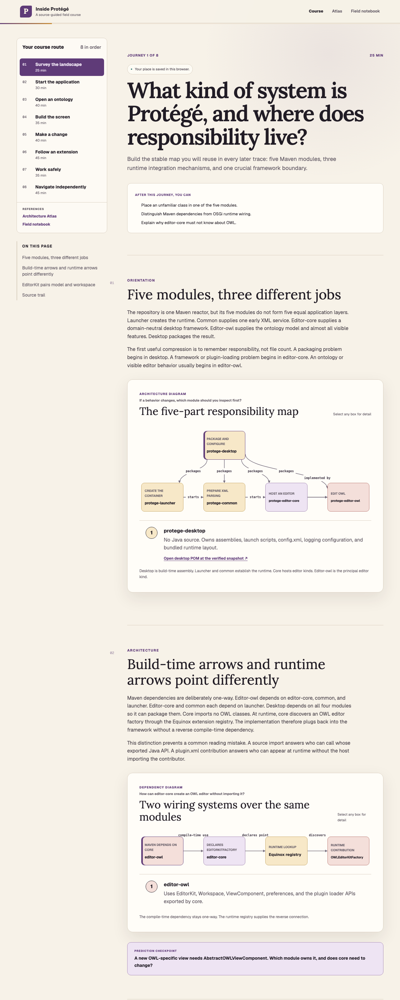
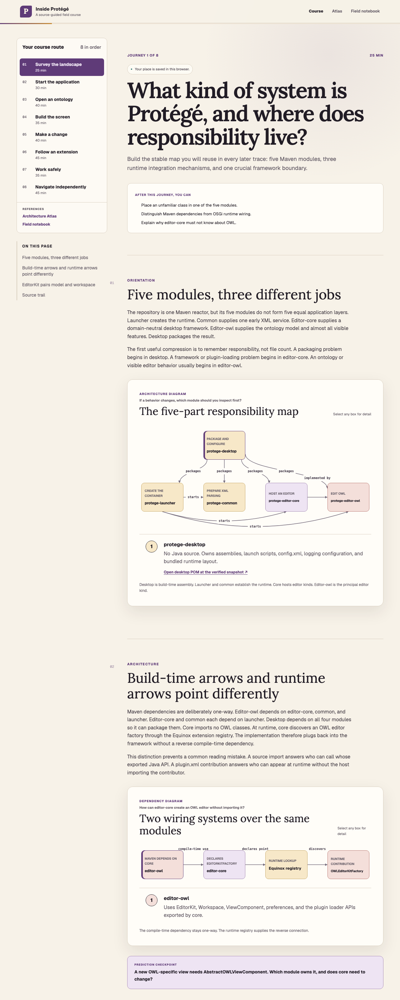
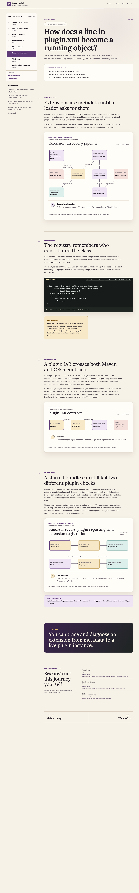

# Diagram edge routing and label placement comparison

Method: headless Chrome (`--headless=new`), production build served by
`npm run start`, viewport width 1280. Window heights: 3200 for
`/journeys/landscape`, 1500 for `/atlas`, 8200 for `/journeys/extension`.
The Before screenshots render commit `f1fe969`; the After screenshots render
the diagram-routing fix in `RelationshipDiagram.tsx` under identical
conditions.

| Area | Before | After |
| --- | --- | --- |
| Same-row edges with a box between endpoints (`editor-owl → launcher`, `launcher → editor-core`, `JAR location → Plugin report`) | Straight line drawn underneath the intervening boxes; the label floated in an unrelated gap, reading as a nonexistent edge between neighbors | Routed as an arc through the open lane below the row, with the label on the arc apex |
| Label collisions | Two `depends on` labels overlapped near the launcher box on the Atlas Modules lens | Labels avoid node boxes and one another; colliding labels shift into free space, and a shifted label must stay inside the canvas (a nudge may not clip a top-row label out of view) |
| Diagram card height | Arcs would have been clipped at the stage edge | The stage reserves a bottom lane (`--diagram-arc-lane`) only when a bottom-row arc exists |

## Atlas, Modules lens

## Journey 1, five-part responsibility map

## Journey 6, bundle lifecycle diagnostic diagram

Reproduce: `npm run build && npm run start`, then render `/atlas`,
`/journeys/landscape`, and `/journeys/extension#silent-discovery` at a
1280-wide viewport and compare the connection lines and labels.
