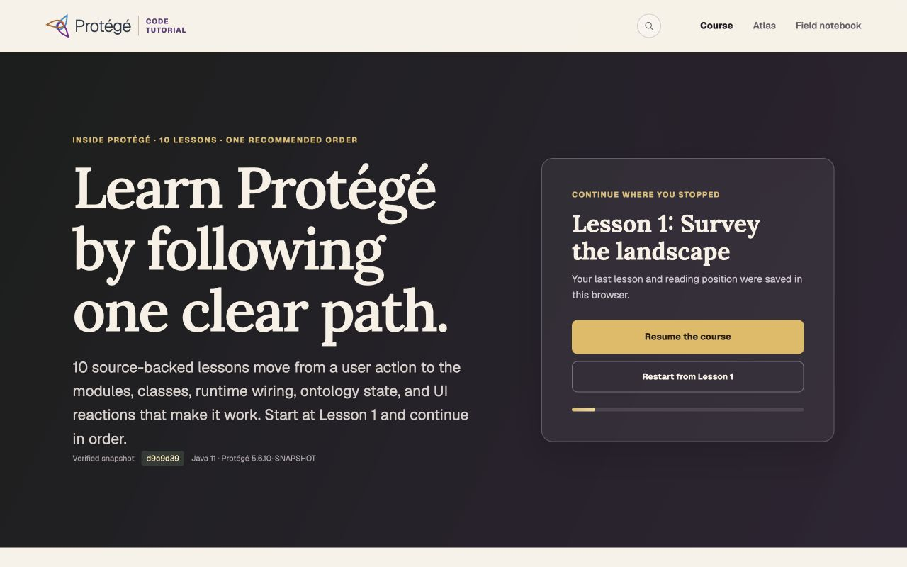

# Header search utility comparison

This comparison records the approved change from a text navigation item to a
separate search utility. Both versions were rendered from production builds in
the Codex in-app browser. The baseline is commit `e60ca46`; the revised view is
the working tree immediately after that commit.

## Measured result

| Concern | Before | After |
| --- | --- | --- |
| Navigation hierarchy | Search appeared as the second text item inside the primary menu. | Search is an icon-only utility before the primary menu. |
| Visual treatment | Same styling and spacing as Course, Atlas, and Field notebook. | A 16px magnifier sits inside a subtle 34px circle with no shadow. |
| Separation | Search used the same 28px desktop gap as neighboring menu items. | Search has a 50px desktop gap before Course; menu items retain a 28px gap. |
| Interaction target | Text-link target. | The visible circle is 34 by 34px inside a 44 by 44px link target. |
| Accessible name | Visible text supplied the name. | The icon-only link is named “Search the Protégé Code Tutorial.” |
| Mobile fit | 390px document width at a 390px viewport. | 390px document width at a 390px viewport; the 44px search target and primary menu fit on the second header row. |
| Favicon at the comparison revisions | `/protege-icon.svg`. | Unchanged by the search treatment itself. Commit `25ac9d8`, made later, added an ICO fallback while retaining the official SVG alternative. |

The production interaction check followed the utility link from `/` to
`/search` and found the search-page heading “Find the lesson, concept, class,
or tool you need.”

## Desktop, 1280 by 800




## Mobile, 390 by 844


## Reproduction

```bash
npm run build
npm run start
```

Inspect `/` at 1280 by 800 and 390 by 844. Activate the search icon with a
mouse and keyboard and confirm that it opens `/search`. The exact historical
comparison is `e60ca46` versus `50fd3e9`; current favicon metadata intentionally
differs because of the later compatibility fix.
