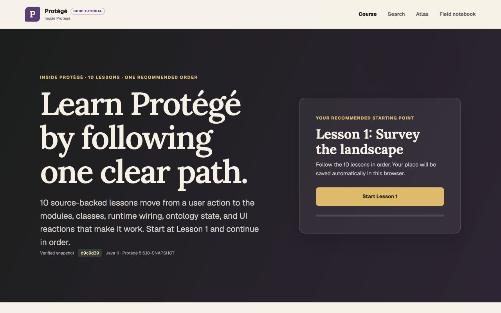
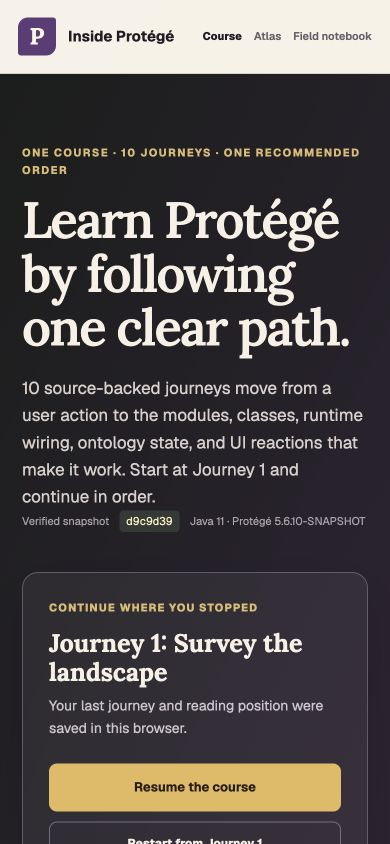
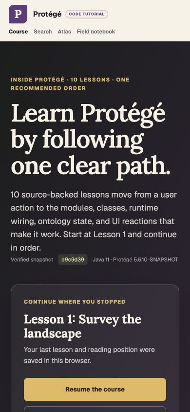
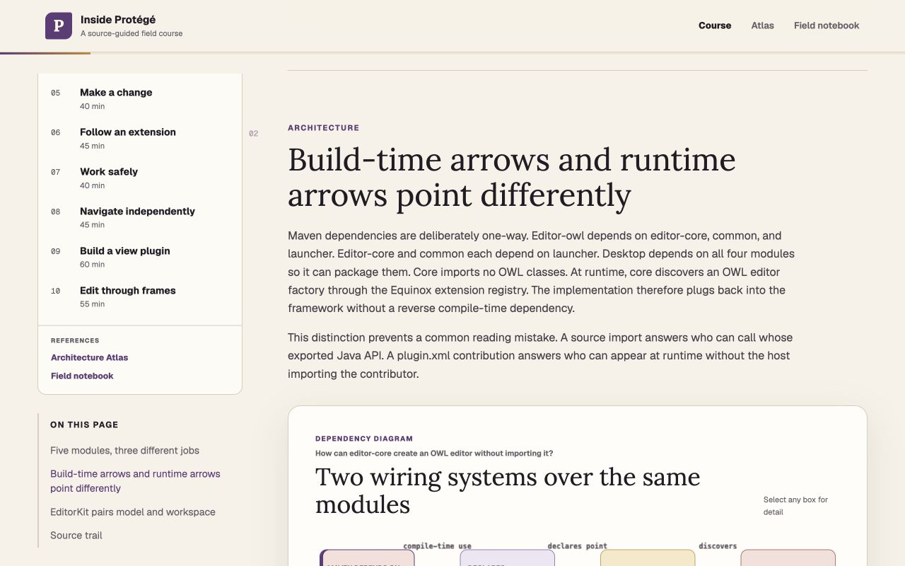
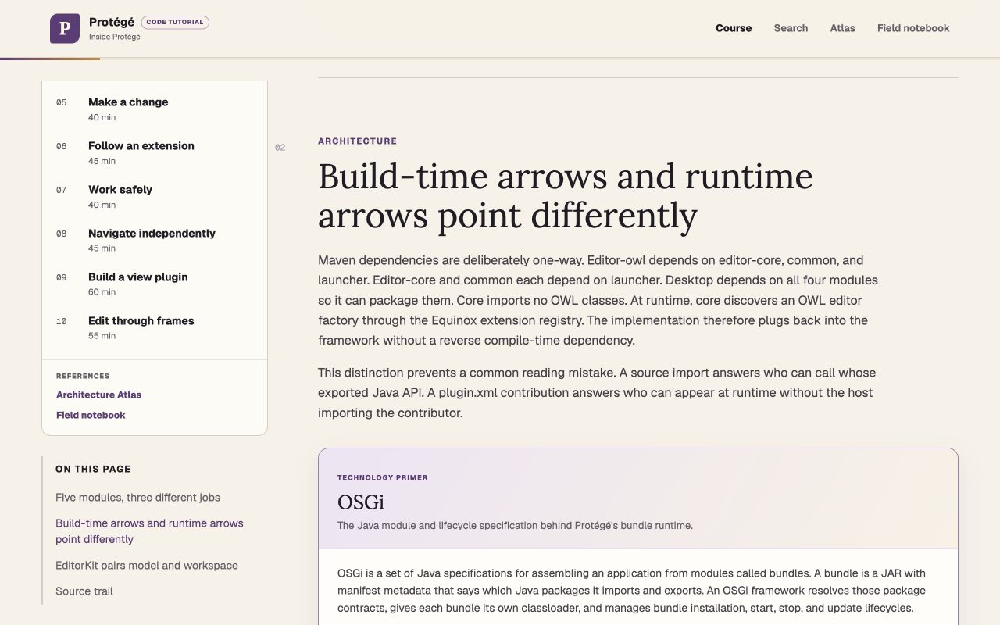
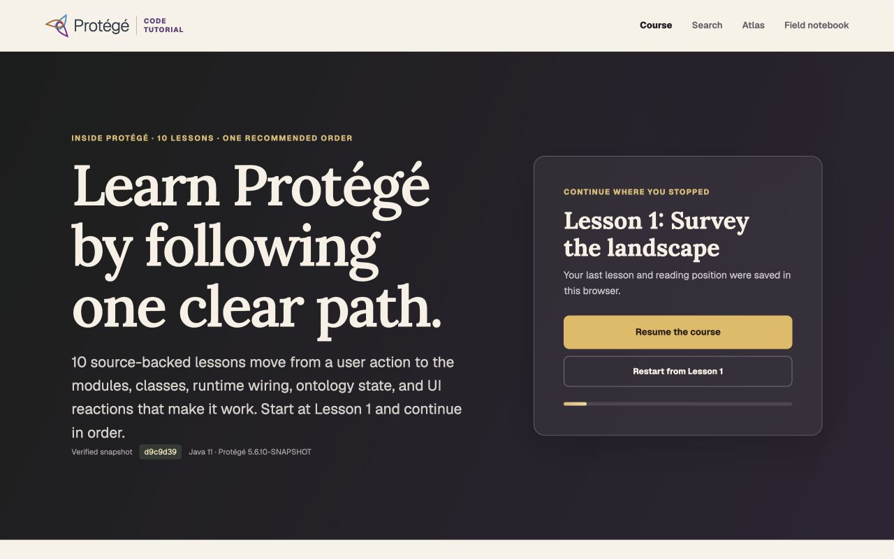

# Terminology, search, and branding comparison

This comparison records the learner-visible effect of the terminology,
search, and branding update. The baseline is commit `cd4f834`; the revised
screenshots use the working tree that followed commits `221dce2` and
`3c46f72`. Both revisions were rendered with `npm run build` and
`npm run start` in the Codex in-app browser.

## Measured result

| Concern | Before | After |
| --- | --- | --- |
| Technology orientation | Lesson 1 had no technology primers and no official technology links. | The course defines nine reusable primers. Lesson 1 introduces OWL, the OWL API, OSGi, and Equinox before relying on those terms. |
| Source of record | Platform names appeared without a dedicated route to general documentation. | Every primer separates the general concept from its verified role in Protégé and opens its official reference in a new tab. |
| Course search | The header had no search entry and the application had no search route. | The header exposes a server-rendered GET search covering lessons, section copy, diagrams, code cutaways, exercises, technology primers, the Atlas, and the Field notebook. |
| Course language | The home page used “journey” 12 times. | Learner-facing home-page copy uses “lesson” 12 times and “journey” zero times. The `/journeys/...` URL is retained as a compatibility detail. |
| Brand hierarchy | The lockup read “Inside Protégé” with the generic subtitle “A source-guided field course.” | The lockup reads “Protégé Code Tutorial” and retains “Inside Protégé” as the course name. |
| Responsive fit | Baseline home page captured at desktop and mobile sizes. | At 1280 by 800 and 390 by 844, the revised home page has no horizontal overflow. The search page also has no horizontal overflow at 390 by 844. |

The production check also found that all 17 external primer links rendered in
Lesson 1 use `target="_blank"`. The count includes official technology
references and pinned Protégé source links.

## Home page

### Desktop, 1280 by 800




### Mobile, 390 by 844





## First OSGi explanation

The screenshots below show the same Lesson 1 section at 1280 by 800. In the
baseline, the section proceeds directly from the heading into course material.
In the revised version, the OSGi primer establishes the concept, explains why
it matters in Protégé, and provides official and pinned-source links before the
lesson uses the term further.





## Reproduction

```bash
npm ci
npm run build
npm run start
```

Inspect `/`, `/search?q=OSGi`, and
`/journeys/landscape#two-directions`. For the baseline, render commit
`cd4f834` in a separate worktree with the same production commands and viewport
sizes.

## Official Protégé mark refinement

The initial tutorial lockup at commit `464716f` used a custom letter P because
the official brand reference had not yet been supplied. The revised lockup uses
the three-color icon published by the official Protégé website, follows it with
the Protégé wordmark treatment, and places “Code Tutorial” after a quiet
divider. “Inside Protégé” remains the course name in the page title and course
content instead of competing with the product logo.

| Aspect | Before at `464716f` | After |
| --- | --- | --- |
| Mark | Custom purple P tile | Official three-color Protégé icon |
| Name treatment | Protégé plus a small pill and a second “Inside Protégé” line | Protégé wordmark plus a separate Code Tutorial suffix |
| Desktop fit | 1280-pixel viewport | 1280-pixel viewport, 1280-pixel document width |
| Mobile fit | 390-pixel viewport | 390-pixel viewport, 390-pixel document width, 81-pixel wrapped header |

### Desktop, 1280 by 800




### Mobile, 390 by 844


The source asset is
`https://protege.stanford.edu/img/protege-icon.svg`. Reproduce the revised
captures from `/` using the production commands above and the stated viewport
sizes.
